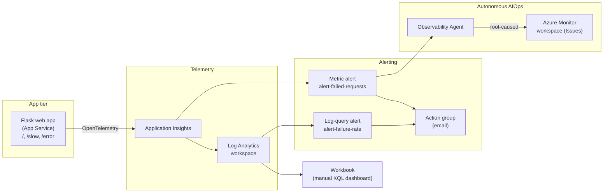

# Azure Monitor Observability Agent — End-to-End Demo

A self-contained, reproducible demo of the **Azure Monitor Observability Agent**
(`Microsoft.Monitor/observabilityAgents`) — the autonomous AIOps capability that
correlates Azure Monitor alerts and produces root-caused **Issues** with AI-generated
investigations.

The demo deploys a small instrumented Flask app that emits real telemetry, deliberately
fails an endpoint to fire two alerts (a metric alert and a log-query alert), and lets the
Observability Agent autonomously diagnose the failure — while also demonstrating the
**human-in-the-loop** manual *Investigate* path.

> ⚠️ The Observability Agent is a **preview** Azure Monitor feature and its portal/API
> surface changes frequently. See the Troubleshooting section of `DEMO_GUIDE.md` for known
> preview quirks (issue dedup, status/impact-time PATCH bugs, agent-mode editing).

## Architecture



The web app emits OpenTelemetry to Application Insights (backed by Log Analytics). A failing
`/error` endpoint drives two alerts — a **metric** alert and a **log-query** alert. The
**Observability Agent** autonomously correlates the alert on its monitored resource and writes
a root-caused **Issue** into the Azure Monitor workspace. The workbook offers a manual KQL view
for the human-in-the-loop path.

## What gets deployed

| Component | Purpose |
|---|---|
| Log Analytics workspace | Telemetry store (KQL backend) |
| Application Insights | APM: requests, traces, exceptions |
| Flask web app (App Service) | Emits telemetry; has a broken `/error` endpoint |
| Action group | Email notifications |
| Metric alert + log-query alert | Fire on failures / failure-rate |
| Azure Monitor workspace (AMW) | Stores agent-created Issues |
| Workbook | Manual KQL dashboard (6 tiles) |
| **Observability Agent** | **Autonomous AI root-cause analysis** |

## Prerequisites

- An Azure subscription where you can create resources
- [Azure CLI](https://learn.microsoft.com/cli/azure/install-azure-cli) (`az login` completed)
- PowerShell 7+ (`pwsh`)
- App Service VM quota in your chosen web region (the script defaults to `westus2` and
  **auto-falls-back** to `centralus`/`westus3`/`westeurope` if a region is at capacity;
  some subscriptions have **0** quota in `eastus`/`eastus2` even for the Free F1 tier)
- Access to the **Observability Agent preview** in your tenant

## Quickstart

```powershell
# 1. Sign in and pick your subscription
az login
az account set --subscription "<your-subscription>"

# 2. Deploy everything from scratch (Log Analytics, App Insights, web app,
#    alerts, AMW, workbook, and the Observability Agent)
.\deploy-all.ps1 -Subscription "<your-subscription-id>" -NotifyEmail "you@example.com"

# 3. Generate traffic + errors to trigger the alerts and the agent
.\generate-errors.ps1

# ...watch the agent create an Issue, then stop the load:
.\stop-errors.ps1
```

`deploy-all.ps1` prints the inventory (resource names + IDs) for **your** deployment when it
finishes. Use those values wherever `DEMO_GUIDE.md` shows `<placeholder>` tokens.

## Files

| File | What it is |
|---|---|
| `DEMO_GUIDE.md` | Full walkthrough: architecture, KQL, live demo script, FAQ, troubleshooting |
| `deploy-all.ps1` | One-command parameterized deploy of the entire backbone |
| `app.py` / `requirements.txt` | The instrumented Flask app (`/`, `/slow`, `/error`) |
| `obsagent.json` | ARM template for the Observability Agent |
| `workbook.ps1` | Builds the manual KQL dashboard workbook |
| `generate-errors.ps1` | Load/error generator (triggers the alerts) |
| `stop-errors.ps1` | Stops any running generator |

## Run the demo

See **[`DEMO_GUIDE.md`](DEMO_GUIDE.md)** for the complete ~12–15 minute live demo script,
the autonomous-vs-manual investigation discussion, KQL queries (workspace **and** classic
App Insights schemas), and a troubleshooting reference.

## Cleanup

```powershell
az group delete -n rg-obs-demo --yes --no-wait
```

## License

[MIT](LICENSE)

> The tenant/subscription/resource IDs shown in `DEMO_GUIDE.md` are placeholders or
> example values from one reference deployment — replace them with your own.
